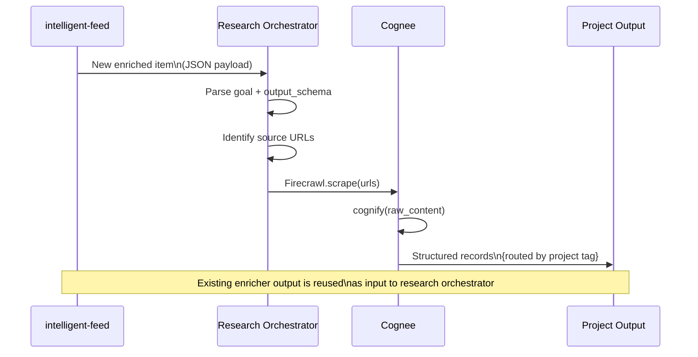

# Research Pipeline Plan: Firecrawl + Cognee Integration

**Date:** 2026-04-09
**Status:** Draft
**Author:** AI Assistant

---

## Context

Across multiple projects — GlobalBitings, bond-nexus, and future ventures — the same fundamental problem recurs: **research, distillation, documentation, and activation**. The current approach relies on ad-hoc scripts, manual research, and project-specific extraction pipelines that don't share infrastructure.

This plan proposes a unified, reusable pipeline built on two open-source tools: **Firecrawl** (web scraping/content extraction) and **Cognee** (knowledge graph + vector hybrid storage with LLM-driven extraction), integrated with the existing stack.

---

## Goals

1. Replace brittle, project-specific web scraping in GlobalBitings
2. Provide a structured extraction layer for market research in bond-nexus
3. Build a reusable pipeline that works across any future project requiring research automation
4. Integrate with intelligent-feed for proactive source monitoring
5. Route structured output to project-specific knowledge stores

---

## Non-Goals

- Replacing existing RAG/research_tool Q&A capabilities (rag_research_tool stays)
- Replacing RAGResearchTool.py graph management (it stays, it works well)
- Building a general-purpose AI agent platform
- Implementing real-time streaming (scheduled batch is sufficient for v1)

---

## Existing Landscape

### Active Repos

| Repo | Role | Key Files |
|------|------|-----------|
| `~/GithubProjects/GlobalBitings` | Dish-first restaurant discovery | `shapes/ExtractBlogDishes.py`, `shapes/ExtractContent.py`, `data/dish_graph/` |
| `~/GithubProjects/bond-nexus` | EM bond yield calculation engine | `docs/markets/`, `docs/technical/MARKET_SOURCES.md`, `nexus_poc/conventions/` |
| `~/GithubProjects/rag_research_tool` | PDF → Weaviate → Q&A | `streamlit_app.py`, `run_pdf_loader.py` |
| `/home/desktopuser/repos/patelmm79/intelligent-feed` | RSS/PyPI monitoring + Claude enrichment | `intel/fetcher.py`, `intel/enricher.py`, `intel/router.py` |

### Intelligent-Feed Architecture

```
Sources (RSS, PyPI) → Fetcher → Enricher (Claude API) → Router → Renderers
                                                           ├─ digests/ (human)
                                                           └─ agent-payloads/ (agent JSON)
```

### GlobalBitings Extraction Pipeline

```
Blog article → ExtractBlogDishes.py → extraction_log.jsonl → RAGResearchTool.py --sync
                                                           → dish_graph/
                                                           → nodes.csv, edges.csv
```

### RAGResearchTool Capabilities (existing, worth keeping)

- Edge provenance tracking
- Conflict detection (same dish, different descriptions)
- Source credibility weighting (wikidata=0.9, blog=0.6, etc.)
- Graph snapshots before/after builds
- Configurable merge keys per source type

---

## Proposed Architecture

### System Overview

```
┌─────────────────────────────────────────────────────────────────────────────┐
│                         RESEARCH PIPELINE                                     │
│                                                                              │
│  ┌───────────────────┐     ┌────────────────────┐     ┌────────────────┐ │
│  │  intelligent-feed │────▶│  Research          │────▶│    Cognee      │ │
│  │  (source monitor) │     │  Orchestrator      │     │                │ │
│  │  - RSS feeds      │     │  (new, lightweight)│     │  cognify()     │ │
│  │  - PyPI monitor   │     │                    │     │  ────────────   │ │
│  │  - manual trigger │     │  goal + sources    │     │  LLM extracts  │ │
│  │                   │     │  + output schema   │     │  entities +    │ │
│  └───────────────────┘     └─────────┬──────────┘     │  relationships │ │
│                                      │                └───────┬────────┘ │
│  ┌───────────────────────────────────┴─────────────────────┐   │          │
│  │                    SOURCE HANDLERS                       │   │          │
│  │                                                         │   │          │
│  │  ┌──────────────┐  ┌───────────────┐  ┌─────────────┐ │   │          │
│  │  │  Firecrawl   │  │  PDF/Docling  │  │  API clients│ │   │          │
│  │  │  • search()  │  │  • parse()    │  │  • Banxico  │ │   │          │
│  │  │  • scrape()  │  │  • extract()  │  │  • ThaiBMA  │ │   │          │
│  │  │  • crawl()   │  │               │  │  • BMV     │ │   │          │
│  │  │  • map()    │  │               │  │  • etc.    │ │   │          │
│  │  └──────┬───────┘  └───────┬───────┘  └──────┬──────┘ │   │          │
│  │         │                   │                   │        │   │          │
│  └─────────┴───────────────────┴───────────────────┴────────┘   │          │
│                                │                                      │          │
│                                ▼                                      │          │
│                     ┌──────────────────────┐                         │          │
│                     │  Structured Records  │                         │          │
│                     │  { fact, source_url,  │                         │          │
│                     │    date, tags[],     │                         │          │
│                     │    project,          │                         │          │
│                     │    confidence }       │                         │          │
│                     └──────────┬───────────┘                         │          │
└──────────────────────────────────│──────────────────────────────────┘          │
                                   │                                             │
              ┌────────────────────┼────────────────────┐                      │
              ▼                    ▼                    ▼                      │
┌─────────────────────┐  ┌─────────────────┐  ┌─────────────────┐             │
│    GLOBALBITINGS    │  │   BOND-NEXUS    │  │ FUTURE PROJECTS  │             │
│                     │  │                 │  │                 │             │
│ extraction_log.jsonl│  │ conventions.yaml│  │ project-specific │             │
│ ────────────────── │  │ ─────────────── │  │ knowledge store  │             │
│ • dish_name         │  │ • market facts │  │                 │             │
│ • restaurant        │  │ • convention   │  │                 │             │
│ • city/country      │  │   code        │  │                 │             │
│ • source_url        │  │ • source_url  │  │                 │             │
│ • confidence        │  │ • date        │  │                 │             │
│ • extraction_id     │  │ • confidence  │  │                 │             │
│         │           │  │         │      │  │                 │             │
│         ▼           │  │         ▼      │  │                 │             │
│ RAGResearchTool     │  │ Auto-regen    │  │                 │             │
│ --sync (existing)  │  │ MARKET_SOURCES│  │                 │             │
│                     │  │ when upstream │  │                 │             │
│                     │  │ changes       │  │                 │             │
└─────────────────────┘  └─────────────────┘  └─────────────────┘             │
```

### Data Flow

```mermaid
flow TB
    subgraph Sources["Source Layer"]
        RSS["RSS Feeds"]
        PyPI["PyPI Monitor"]
        Web["Web (Firecrawl)"]
        PDF["PDF Docs"]
        API["Market APIs\nBanxico, ThaiBMA, BMV"]
    end

    subgraph IntelligentFeed["intelligent-feed (existing)"]
        Fetcher["Fetcher"]
        Enricher["Enricher\nClaude API"]
        Router["Router"]
    end

    subgraph ResearchOrchestrator["Research Orchestrator (new)"]
        Goal["Research Goal\n+ Output Schema"]
        Route["Project Router\nby tag/project"]
    end

    subgraph Cognee["Cognee (new)"]
        Cognify["cognify()\nLLM extraction"]
        VecStore["Vector Store\nembeddings"]
        GraphStore["Graph Store\nentities + relations"]
        RelStore["Relational Store\nprovenance"]
    end

    subgraph Outputs["Project Outputs"]
        GB["GlobalBitings\nextraction_log.jsonl"]
        BN["bond-nexus\nconventions.yaml"]
        Other["Future Projects"]
    end

    RSS --> Fetcher
    PyPI --> Fetcher
    Web --> Firecrawl
    PDF --> Firecrawl
    API --> Firecrawl

    Fetcher --> Enricher
    Enricher --> Router
    Router --> Goal

    Firecrawl --> Cognify
    PDF --> Cognify

    Cognify --> VecStore
    Cognify --> GraphStore
    Cognify --> RelStore

    Goal --> Route
    Route --> GB
    Route --> BN
    Route --> Other
```

### Cognee Internal Architecture

```mermaid
flow TB
    subgraph Ingestion["Ingestion Phase"]
        Raw["Raw Data\nweb, PDF, API"]
        Firecrawl["Firecrawl\nscrape/crawl"]
        Chunk["Chunking\ntext splitting"]
        Embed["Embedding\ngenerate vectors"]
    end

    subgraph Storage["Cognee Storage (3-layer)"]
        RelStore["Relational Store\ndocuments, chunks, provenance"]
        VecStore["Vector Store\nembeddings for semantic search"]
        GraphStore["Graph Store\nentities + relationships"]
    end

    subgraph Retrieval["Retrieval Phase"]
        SemSearch["Semantic Search\nvector similarity"]
        StructSearch["Structural Search\nCypher queries"]
        Hybrid["Hybrid Search\nvector + graph combined"]
    end

    subgraph Output["Structured Output"]
        Records["{fact, source_url,\ndate, tags[], project,\nconfidence}"]
    end

    Raw --> Firecrawl
    Firecrawl --> Chunk
    Chunk --> Embed
    Embed --> VecStore
    Chunk --> RelStore

    Raw --> Cognify
    Cognify --> GraphStore
    Cognify --> RelStore

    SemSearch --> Records
    StructSearch --> Records
    Hybrid --> Records
```

### Project Routing

```mermaid
flow LR
    Record["Structured Record\n{fact, source, tags, project}"]

    Record --> GB_Route{"project = 'globalbitings'?"}
    Record --> BN_Route{"project = 'bond-nexus'?"}
    Record --> Default{"Catch-all\n(other projects)"}

    GB_Route --> GB_Output["extraction_log.jsonl\n→ RAGResearchTool --sync"]
    BN_Route --> BN_Output["conventions.yaml update\n→ doc regeneration"]
    Default --> Other["project-specific\nknowledge store"]
```

### Intelligent-Feed Integration



---

## Tool Analysis

### Firecrawl

| Aspect | Detail |
|--------|--------|
| License | AGPL-3.0 (self-host) / Paid API (cloud) |
| What it does | JS-aware web scraping → clean markdown/JSON |
| Key methods | `search()`, `scrape()`, `crawl()`, `map()`, `batch_scrape()` |
| Why it fits | Replaces bespoke `ExtractBlogDishes.py` / `ExtractContent.py` which break on JS-heavy sites |
| Self-host | Yes, fully open source |

### Cognee

| Aspect | Detail |
|--------|--------|
| License | Apache 2.0 |
| What it does | Diverse data → knowledge graph + vector store; LLM-driven entity extraction |
| Key methods | `cognify()`, `add()`, `search()` |
| Why it fits | Exactly the "distillation" problem — structured facts from unstructured sources |
| Storage | 3-layer: relational + vector + graph. Lightweight defaults, swappable backends |
| Self-host | Yes |

---

## What Stays, What Changes

| Component | Action | Reason |
|-----------|--------|--------|
| `intelligent-feed` fetcher/router/renderers | Keep | Proven, works |
| `intelligent-feed` enricher | Extend | Add structured extraction prompt variant |
| `rag_research_tool` (PDF → Weaviate → Q&A) | Keep | Right tool for document Q&A |
| `RAGResearchTool.py` (graph sync/conflicts/provenance) | Keep | Already handles this well |
| `ExtractBlogDishes.py` | Replace | Brittle, JS-handling is hard |
| `ExtractContent.py` | Replace | Replaced by Firecrawl's `scrape()` |
| `extraction_log.jsonl` schema | Keep | Proven, just change upstream producer |
| `conventions.yaml` | Keep | Right structure, just auto-populate |

---

## Implementation Phases

### Phase 1 — Foundation (1-2 days)

**Goal:** Verify Firecrawl + Cognee work for GlobalBitings use case

- [ ] Install Firecrawl (`pip install firecrawl-py`) and test `scrape()` on a sample food blog
- [ ] Install Cognee and run `cognify()` on scraped content
- [ ] Verify output schema: `{fact, source_url, date, tags[], project, confidence}`
- [ ] Wire Firecrawl → Cognee → JSONL output (manual, no orchestration yet)
- [ ] Validate output against existing `extraction_log.jsonl` schema

**Deliverable:** A single Python script that takes a URL → produces valid extraction records

### Phase 2 — Intelligent-Feed Integration (1-2 days)

**Goal:** Connect new extraction to intelligent-feed pipeline

- [ ] Add new renderer in intelligent-feed: `StructuredRenderer`
- [ ] New subscription type: `structured` (vs. existing `human` / `agent`)
- [ ] Enricher prompt variant for structured extraction (not just summarization)
- [ ] Route structured records to correct project based on `project` tag
- [ ] Write to `output/structured/` directory per project

**Deliverable:** New intelligent-feed subscription type producing project-routed structured records

### Phase 3 — GlobalBitings Cutover (1-2 days)

**Goal:** Replace brittle extraction scripts with Firecrawl + Cognee

- [ ] Migrate `shapes/ExtractBlogDishes.py` to use `scrape()` + `cognify()`
- [ ] Map Cognee output to `extraction_log.jsonl` schema
- [ ] Run `RAGResearchTool.py --sync` to verify graph sync still works
- [ ] Test conflict detection on new extractions
- [ ] Archive (don't delete) old extraction scripts

**Deliverable:** GlobalBitings extraction running on new pipeline; old scripts archived

### Phase 4 — bond-nexus Research Automation (2-3 days)

**Goal:** Auto-populate market sources from structured research

- [ ] Define bond-nexus output schema: `{fact, convention_code, source_url, date_retrieved, confidence}`
- [ ] Configure Banxico + ThaiBMA API handlers as Cognee sources
- [ ] Build convention update trigger: when Cognee finds changed spec → regenerate `MARKET_SOURCES.md`
- [ ] Test: inject a fake spec change, verify `MARKET_SOURCES.md` updates correctly

**Deliverable:** bond-nexus market sources updating automatically from live research

### Phase 5 — Generalization (2-3 days)

**Goal:** Make the orchestrator truly project-agnostic

- [ ] Define `ResearchTask` schema: `{goal, sources[], output_schema, project_tag}`
- [ ] Build simple CLI: `research run --goal "..." --project bond-nexus --output-schema convention`
- [ ] Add PDF source handler (via Docling or existing rag_research_tool loader)
- [ ] Write integration tests with mocked sources
- [ ] Document the SDK for future projects

**Deliverable:** Reusable `research` CLI and SDK for any project

---

## Risks & Mitigations

| Risk | Likelihood | Impact | Mitigation |
|------|------------|--------|------------|
| Firecrawl blocks on target sites | Medium | Medium | Self-host with proxy rotation; fall back to PDF where available |
| Cognee extraction quality inconsistent | Medium | Medium | Tune prompt per project; keep human review step for high-stakes facts |
| Schema drift across projects | Low | Low | Enforce output_schema validation; version the schema |
| intelligent-feed enrichment cost | Medium | Low | Batch items; structured extraction is fewer calls than full summarization |
| Breaking existing GlobalBitings graph sync | Low | High | Test `--sync` on small sample before full cutover |

---

## Appendix: Key Repos & Links

| Resource | URL |
|----------|-----|
| Firecrawl | https://github.com/mendableai/firecrawl |
| Firecrawl Docs | https://docs.firecrawl.dev |
| Firecrawl PyPI | https://pypi.org/project/firecrawl-py |
| Cognee | https://github.com/topoteretes/cognee |
| Cognee Docs | https://docs.cognee.ai |
| intelligent-feed | `/home/desktopuser/repos/patelmm79/intelligent-feed` |
| GlobalBitings | `~/GithubProjects/GlobalBitings` |
| bond-nexus | `~/GithubProjects/bond-nexus` |
| rag_research_tool | `~/GithubProjects/rag_research_tool` |

---

## Appendix: Open-Source License Summary

| Tool | License | Commercial Use | Modify | Distribute |
|------|---------|---------------|--------|------------|
| Firecrawl | AGPL-3.0 | ✅ Yes | ✅ Yes | ✅ Yes (if disclose source) |
| Cognee | Apache 2.0 | ✅ Yes | ✅ Yes | ✅ Yes |
| intelligent-feed | (existing, verify) | — | — | — |
| CrewAI | MIT | ✅ Yes | ✅ Yes | ✅ Yes |
| Mem0 | Apache 2.0 | ✅ Yes | ✅ Yes | ✅ Yes |

AGPL-3.0 note: If you modify Firecrawl and distribute it as a service, you must disclose your modifications under AGPL. Self-use has no restrictions.
